# Genea Video Management System

An open-source live video streaming solution: RTSP sources are ingested by
MediaMTX, viewed live in the browser over WebRTC/WHEP, recorded, and played
back from history — with optional AI analytics and semantic event search layered
on top as isolated extensions. Everything runs on one host as four independent
Docker Compose stacks. No proprietary streaming engine is used anywhere.

```text
RTSP source ─▶ VMS (MediaMTX) ─▶ WebRTC live view in the browser
                    └─────────▶ recording ─▶ historical playback
```

Analytics (YOLO11n line-crossing events) and Semantic Search (SigLIP text/image
event retrieval) are optional extensions that consume that stream. Neither can
interrupt live view or recording.

---

## Assignment coverage

| Assignment requirement | Implementation | Evidence and caveats |
| --- | --- | --- |
| **Video capture** — compatible with standard IP cameras and webcams | The VMS registers any RTSP URL, including credentialed camera URLs. The bundled RTSP Simulator turns a video file into a real RTSP camera via FFmpeg + MediaMTX, so the chain can be exercised without hardware. | Validated end to end against simulated RTSP sources. **No credentialed physical IP camera and no direct webcam adapter were tested end to end.** |
| **Streaming protocol** — open-source protocols only | RTSP/TCP for ingest and redistribution, WebRTC/WHEP for browser delivery, all served by MediaMTX. FFmpeg publishes; GStreamer decodes only where analytics needs raw frames. | No proprietary streaming engine, SDK or cloud video service. |
| **Destination** — cloud platform or local server | Local single-host reference deployment: MediaMTX is the streaming server, four Compose stacks are the deployment. | Amazon Kinesis Video Streams was not integrated (explicitly optional). |
| **Web player** — live feed *and* playback | Browser plays live over WHEP/WebRTC; recorded timespans are listed by camera and UTC date and played directly from MediaMTX's playback server. | Chromium-verified. Playback responses carry `Accept-Ranges: none`, so there is no byte-range seeking within a segment. |
| **Documentation** — setup, dependencies, run steps | This README, [architecture](docs/architecture.md), [demo guide](docs/demo-guide.md), [validation](docs/validation.md), four service READMEs, and generated Swagger on every service. | — |
| **Code quality** — clean, structured, commented | Layered services (API / domain / services / persistence), typed domain models, per-service dependency locks. | — |
| **Testing** — common failure scenarios | 1,384 automated tests across unit, integration, real-model, multi-camera and end-to-end tiers, plus a 38-check root smoke test and manual live acceptance. | Exact totals and the four documented skips are in [validation](docs/validation.md). |
| **Scalability** — handling increased load | Current single-host design documented with its real limits, and a separate, explicitly **not implemented** scale-out direction. | See [Reliability and scalability](#reliability-and-scalability). |
| **Network outage handling** | VMS reports source health separately from player state; Analytics reconnects with exponential backoff; Semantic Search stays locally searchable while its upstream is down and resyncs automatically. | Selected outage cases were measured — this is not broad chaos testing. |
| *Optional:* **AI inference** | GStreamer H.264 decode → YOLO11n detection → ByteTrack tracking → directional line crossing → durable event with metadata, crop and full frame. | Extension. Six object classes; no re-identification; no accuracy benchmark. |
| *Optional:* **Enhanced object search** | SigLIP embeddings of each event's crop and frame, searchable by free text or by uploaded image, with camera / category / class / direction / time filters. | Extension. Event-oriented retrieval with an exact NumPy cosine index — not a vector database and not RAG. |
| *Optional:* **Performance optimization** | Latest-frame-drop sampling, configurable inference FPS, a shared non-queuing detector, and an immutable in-memory search snapshot. | No profiling campaign was run; this is design-level, not a measured optimization study. |
| **Deployment scripts / config** | Four Compose stacks plus root `start-all` / `status` / `smoke-test` / `stop-all` wrappers. | Single-host reference deployment, not production orchestration. |

---

## Architecture at a glance

```mermaid
flowchart LR
  subgraph C1["Component 1 · RTSP Simulator (:8080)"]
    SRC["Video file<br/>upload or mounted sample"]
    FFM["FFmpeg publisher"]
    M1["MediaMTX"]
    SRC --> FFM --> M1
  end

  subgraph VMS["Components 2 + 3 · VMS (:8090)"]
    API2["FastAPI<br/>cameras · recordings"]
    M2["MediaMTX<br/>ingest · WebRTC · record · playback"]
    REC[("genea-vms-recordings")]
    M2 --> REC
  end

  subgraph C4["Component 4 · Video Analytics (:8100)"]
    GST["GStreamer<br/>H.264 decode"]
    YOLO["YOLO11n"]
    BT["ByteTrack"]
    LINE["Line crossing"]
    EVT[("SQLite + JPEG<br/>events")]
    GST --> YOLO --> BT --> LINE --> EVT
  end

  subgraph C5["Component 5 · Semantic Search (:8200)"]
    POLL["Polling and<br/>reconciliation"]
    SIG["SigLIP embeddings"]
    IDX[("SQLite vectors +<br/>NumPy exact index")]
    POLL --> SIG --> IDX
  end

  BROWSER(["Browser"])

  M1 ==>|"RTSP/TCP :8554"| M2
  M2 ==>|"WHEP/WebRTC :8889 + ICE 8189/udp"| BROWSER
  M2 ==>|"redistributed RTSP :8555"| GST
  REC ==>|"playback :9996"| BROWSER

  API2 -.->|"path control :9997 · private"| M2
  EVT -.->|"public HTTP :8100"| POLL
  IDX -.->|"UI and API :8200"| BROWSER
  BROWSER -.->|"control APIs :8080 :8090 :8100 :8200"| API2

  classDef media stroke-width:2px
  class M1,M2,GST media
```



**Reading the diagram.** Thick arrows are the media plane — video bytes moving
between MediaMTX, the browser and the analytics decoder. Dashed arrows are the
control plane — HTTP APIs and UI traffic. **No video ever passes through a
FastAPI process.** The four boxes are four separate Compose projects with four
separate volume sets: there is no shared application database and no shared
Docker network. Component 5 reaches Component 4 only over its public HTTP API —
never its database or filesystem.

A boundary and failure-domain view is in [docs/architecture.md](docs/architecture.md).

---

## Five components, four services

The assignment was implemented as five logical components. Components 2 and 3
are one deployable service, because live view and recording share the same
MediaMTX instance and the same camera registry — splitting them would mean two
processes contending for one media server.

| Logical component | Deployable service | Responsibility | Reviewer-visible surface |
| --- | --- | --- | --- |
| **C1** RTSP Simulator | `services/rtsp-simulator/` | Publishes a video file as a real RTSP camera through FFmpeg + MediaMTX. Stands in for camera hardware. | Dashboard at `:8080`; RTSP at `rtsp://localhost:8554/simulator/<stream_path>` |
| **C2** Live View + **C3** Recording & Playback | `services/vms/` | Registers RTSP cameras, has MediaMTX pull and redistribute them, serves WebRTC live view, records enabled cameras, lists and serves historical playback. | Dashboard at `:8090`; live at `:8889`; playback at `:9996`; RTSP out at `:8555` |
| **C4** Video Analytics | `services/video-analytics/` | Decodes the VMS stream, detects and tracks objects, emits directional line-crossing events with crop and frame images. | Dashboard at `:8100` |
| **C5** Semantic Search | `services/semantic-search/` | Discovers Component 4 events over public HTTP, embeds their images with SigLIP, and serves text and image similarity search. | Dashboard at `:8200` |

---

## Technology stack

| Responsibility | Stack |
| --- | --- |
| APIs and UI hosting | Python 3.12, FastAPI, Uvicorn, vanilla HTML/CSS/JS (no frontend framework) |
| Source simulation | FFmpeg, MediaMTX 1.20.1 |
| VMS media plane | MediaMTX 1.20.1 — RTSP/TCP ingest, WHEP/WebRTC delivery, recording, playback |
| Analytics decode | GStreamer 1.24 (`rtspsrc → rtph264depay → h264parse → avdec_h264 → appsink`) |
| Detection and tracking | Ultralytics YOLO11n (CPU), ByteTrack |
| Event persistence | SQLite + JPEG crop and frame artifacts |
| Semantic retrieval | Pinned SigLIP (base-p16-224), Transformers / PyTorch CPU, 768-D vectors, exact NumPy cosine search |
| Packaging | Docker + Compose v2 — four independent projects, root shell wrappers |

---

## Quick start

### Prerequisites

**Required to run:**

- Git
- Docker Desktop, or a Docker Engine with Compose v2
- Internet access for the *first* build (base images, Python dependencies, and
  the YOLO11n and SigLIP model assets are downloaded at build time, never at
  runtime)
- A modern WebRTC-capable browser — **Chromium is the validated browser**
- Docker memory of **at least 3 GiB**, and disk headroom for four images
  (Semantic Search alone is roughly a 2.9 GB image with an ~812 MB checkpoint)
- Free ports: TCP `8080`, `8090`, `8100`, `8200`, `8554`, `8555`, `8889`,
  `9996`, and UDP `8189`

**Optional, for verification or development only:** `curl`, `ffprobe`,
`pytest`. The containers ship their own FFmpeg and GStreamer — you do not need
either on the host for the normal UI path.

### Start it

```bash
git clone https://github.com/Atharvavp/Genea_VMS.git
cd Genea_VMS

# Component 4 is the one service that needs a local env file before it starts.
cp services/video-analytics/.env.example services/video-analytics/.env

./scripts/start-all.sh    # builds and starts all four stacks in dependency order
./scripts/status.sh       # read-only: what is running and what is ready
./scripts/smoke-test.sh   # 38 non-mutating structural and health checks
```

`start-all.sh` preflights Docker, Compose project identity, `curl` and the
Component 4 `.env`, then starts Simulator → VMS → Analytics → Semantic Search
and polls each `/health` until it is ready. **The first run builds four images
and can take a long time** — Semantic Search is the slowest. `status.sh` is the
readiness authority; it distinguishes "container running" from "application
ready" from "upstream available".

`start-all.sh` will never create or overwrite a `.env` for you. If the
Component 4 file is missing it fails in preflight, starts nothing, and prints
the exact `cp` command above.

The example `CURSOR_SIGNING_KEY` in `.env.example` is a well-known
local-development value. Replace it before any non-local deployment.

### Stop it

```bash
./scripts/stop-all.sh     # reverse order; named volumes are kept
```

`stop-all.sh` runs `docker compose down` **without** `-v`, so every camera,
recording, event and index survives a stop/start cycle. To discard one
service's data, do it explicitly and per service — never repository-wide.

---

## Open the system

| Service | Dashboard | Swagger | Health |
| --- | --- | --- | --- |
| C1 Simulator | `http://localhost:8080/` | `http://localhost:8080/docs` | `http://localhost:8080/health` |
| C2/C3 VMS | `http://localhost:8090/` | `http://localhost:8090/docs` | `http://localhost:8090/health` |
| C4 Analytics | `http://localhost:8100/` | `http://localhost:8100/docs` | `http://localhost:8100/health` |
| C5 Semantic Search | `http://localhost:8200/` | `http://localhost:8200/docs` | `http://localhost:8200/health` |

The machine-readable schema for each service is at `/openapi.json` on the same
port. **Swagger is the API reference** — this README deliberately does not
restate every endpoint.

### Ports and protocols

| Port | Protocol | Owner and use | Note |
| ---: | --- | --- | --- |
| 8080 | HTTP | Simulator UI and API | host-published |
| 8554 | RTSP/TCP | Simulator camera routes | `rtsp://localhost:8554/simulator/<stream_path>` |
| 8090 | HTTP | VMS UI and API | host-published |
| 8555 | RTSP/TCP | VMS redistribution | `rtsp://localhost:8555/vms_<camera-id>` |
| 8889 | HTTP / WebRTC | WHEP live delivery | browser-facing |
| 8189 | UDP | WebRTC ICE media | browser-facing |
| 9996 | HTTP | Historical playback | serves finalized recordings directly to the browser |
| 9997 | HTTP | VMS MediaMTX Control API | **private — deliberately not published.** Not a reviewer-facing API |
| 8100 | HTTP | Analytics UI, API and event images | host-published |
| 8200 | HTTP | Semantic Search UI and API | host-published |

Cross-stack integration runs over published host ports: the VMS pulls
`rtsp://host.docker.internal:8554/simulator/<stream_path>`, Analytics pulls
`rtsp://host.docker.internal:8555/vms_<camera-id>`, and Semantic Search calls
`http://host.docker.internal:8100`. Live WHEP and playback URLs are generated by
the UI and API responses — they are not static addresses to copy from here.

---

## Demo in 12 steps

The full walkthrough, with expected states, waits and troubleshooting for every
step, is in **[docs/demo-guide.md](docs/demo-guide.md)**.

1. `./scripts/start-all.sh`, then `./scripts/status.sh`.
2. At `:8080`, **Add Camera** → choose a source → **Save camera** → **Start**. Wait for `RUNNING`.
3. Copy the camera's RTSP URL from the card.
4. At `:8090`, **Add Camera** → paste the URL as `rtsp://host.docker.internal:8554/simulator/<stream_path>` → tick **Enabled** and **Record continuously** → **Save**.
5. Wait for the tile to report `ONLINE` and the player to reach `LIVE`. Use **Focus** for a large view.
6. Wait for the recording badge to read `RECORDING`, then open **Recordings**, pick today's UTC date and play a finalized timespan.
7. At `:8100`, **Add camera** → the VMS camera id → `rtsp://host.docker.internal:8555/vms_<camera-id>` → **Save**. Wait for `RUNNING`.
8. **Configure line** → drag a line across the path objects actually travel → direction `BOTH` → **Save line**.
9. Let a person or vehicle cross, then open **Events** → **Refresh** and open the event to see its crop and full frame.
10. At `:8200`, wait for the Component 4 badge to read available and `searchable_events` to include the new event.
11. Search by **Text** for what you saw (for example `car`), and inspect the ranked results.
12. Switch to **Image**, upload the event's crop, and search — then open a result for its detail drawer and **View recording**.

> **Media matters for steps 8–12.** The bundled
> `services/rtsp-simulator/sample-media/sample-320x240.mp4` is a 10-second
> FFmpeg `testsrc` pattern. It fully demonstrates RTSP ingest, WebRTC live view,
> recording and playback — but it contains **no person or vehicle**, so it
> cannot produce analytics events. For steps 8–12, supply your own legally
> usable H.264 MP4 in which a supported person or vehicle visibly crosses the
> frame. The demo guide documents both paths.

---

## Engineering choices

Each of these is explained with its tradeoff in
[docs/architecture.md](docs/architecture.md#architecture-decisions-and-tradeoffs).

- **MediaMTX owns the media plane.** Ingest, redistribution, WebRTC, recording
  and playback are delegated to a purpose-built streaming server. The VMS
  process stores desired state and drives MediaMTX through its Control API; no
  video byte passes through Python.
- **WHEP/WebRTC for browser live view**, for low latency without a plugin —
  accepting a narrower codec and browser envelope than HLS would give.
- **No GStreamer in the live path.** GStreamer appears only in Component 4,
  where raw frames are genuinely required. The live path is never decoded or
  re-encoded.
- **Recording is MediaMTX-native**, not Python writing frames, so recording
  cannot be starved by application-level work.
- **Analytics is a separate service with its own failure domain.** An AI
  failure must not be able to stop live view or recording — and cannot.
- **Component 4 owns events; Component 5 derives from them** over the public
  HTTP API only. The semantic index is rebuildable from Component 4 at any time.
- **Exact NumPy cosine search over an immutable snapshot**, not FAISS or a
  vector database, because at the validated scale exact search is simpler,
  dependency-free and fast enough.
- **Four independent Compose projects** with independent volumes, coordinated
  by four thin shell wrappers rather than a root Compose file — so one stack can
  be reset, rebuilt or broken without reaching another.

---

## Validation summary

Recorded during **final Part 1 acceptance** on macOS / Apple Silicon:

| Area | Result |
| --- | --- |
| Automated tests | **1,384 passed**, **4** explicitly documented conditional Semantic Search semantic-quality skips, **0 failures** |
| Real C4 → C5 tier (`real_component4`) | **10 passed, 0 failed, 0 skipped** |
| Live media chain | Real H.264 simulator stream; VMS `OFFLINE → ONLINE`; H.264 RTSP redistribution verified with `ffprobe` |
| Browser live view | Chromium WebRTC with verified moving pixels |
| Recording and playback | Finalized timespan; playback `HTTP 200`, `video/mp4`, independently probed H.264 |
| Real analytics event | A genuine vehicle line crossing, with crop and frame visually confirmed against the recorded bounding box |
| Semantic search | 486 indexed events (972 vectors); text query `car` ranked a car first; the event's own crop returned that event at rank 1, score 1.000000 |
| Failure isolation | Component 4 stopped: Component 5 stayed searchable with identical text and image results, then resynced automatically with no restart |
| Root orchestration | Smoke test **38 passed, 0 failed**; persistence across stop/start; fresh-clone bring-up |

Not "all tests passed" — four conditional skips are real and are described in
[docs/validation.md](docs/validation.md), together with what was **not** tested.

---

## Reliability and scalability

### Reliability, as measured

- Stopping a Simulator camera removes its RTSP route without affecting any other
  stack; the VMS reports the source as offline and recovers when it returns.
- The VMS reports **source health** (`ONLINE` / `OFFLINE` / `UNKNOWN`)
  separately from **browser player state** (`CONNECTING` / `LIVE` /
  `RECONNECTING` / `ERROR`), so a network problem is never confused with a
  player problem. Desired camera and recording state persist across restarts.
- Analytics reconnects to a lost RTSP source with exponential backoff and
  jitter; genuinely fatal model, configuration or storage errors stay explicit
  instead of retrying forever.
- Losing Analytics does not stop live view or recording.
- With Component 4 down, Semantic Search stays available: local search and event
  detail keep working over the already-indexed data, while new indexing and
  upstream-backed images degrade explicitly. Polling resumes on its own.
- Each stack stops independently and owns its own named volumes. Container-level
  loss was survived with all data intact — which is not a guarantee against host
  or disk loss.

### Scalability

**Current implementation.** One host, four Compose projects. One FFmpeg
publisher per simulated camera. MediaMTX carries the whole media plane. Analytics
runs one worker thread per enabled camera with latest-frame-drop sampling and a
configurable 1–10 inference FPS, sharing a single CPU detector through a
non-queuing admission lock, with per-camera tracker state. Persistence is
single-node SQLite plus JPEG files, with no event retention policy in Analytics.
Semantic Search embeds asynchronously and searches an exact in-memory NumPy index
over locally persisted vectors. Four-camera Analytics and Semantic Search scale
tiers were exercised — **they do not establish large-fleet capacity.**

**Future direction — NOT IMPLEMENTED.** Partitioning cameras across VMS and
Analytics nodes; GPU or bounded-batch inference with replicas; an external
metadata database and object storage with retention; an event bus decoupling
detection from indexing; independent index and search replicas; approximate
(ANN) or distributed vector infrastructure *only* once measurements demand it;
metrics, logs, traces and alerting; container orchestration, service discovery,
TLS, authentication, secret management and network policy. None of this exists
in the repository, and none of it should be read as a current capability.

---

## Known limitations

- Single-host deployment with local SQLite and local files. **No authentication
  and no TLS anywhere** — this is a trusted-network local reference deployment,
  not something to expose to the internet.
- H.264 is the validated end-to-end path. The Simulator can publish H.265, but
  that does not imply browser or analytics compatibility.
- No credentialed physical IP camera, no direct webcam adapter, no amd64 host
  and no native Linux `host-gateway` acceptance run.
- Browser end-to-end coverage is Chromium only.
- Analytics supports one line per camera and six classes (`person`, `bicycle`,
  `car`, `motorcycle`, `bus`, `truck`); tracking is session-local, with **no
  re-identification** and no event retention policy.
- The final live acceptance exercised vehicles. The `person` path is implemented
  and tested but was not part of that live scenario.
- Semantic Search searches **Component 4 events only** — not arbitrary video
  frames, and it performs no transcription or identity search. Its accepted
  results come from one fixed traffic corpus and are not a general retrieval
  accuracy claim.
- Four semantic-quality test cases skip without a user-owned, deliberately
  gitignored image cache.
- Recording history can only be browsed while a camera is enabled; playback
  serves no byte ranges; deleting a camera does not clean up orphaned recordings.
- No load, soak or chaos testing, no multi-node failover, no backup/restore
  procedure, and no security or production certification.

---

## Repository map

```text
services/rtsp-simulator/    # Component 1 — RTSP source simulation
services/vms/               # Components 2 and 3 — live view, recording, playback
services/video-analytics/   # Component 4 — detection, tracking, events
services/semantic-search/   # Component 5 — semantic event retrieval
scripts/                    # root lifecycle wrappers (start / status / smoke / stop)
docs/                       # reviewer documentation and engineering evidence
```

Each service directory holds its own Compose project, Dockerfile, dependency
lock, tests and README, and can be run entirely on its own — the root scripts
are convenience wrappers, never a requirement.

---

## More detail

**Reviewer documentation**

- [docs/architecture.md](docs/architecture.md) — boundaries, flows, decisions, tradeoffs, scalability, non-goals
- [docs/demo-guide.md](docs/demo-guide.md) — the deterministic end-to-end walkthrough
- [docs/validation.md](docs/validation.md) — what was measured, how, and what was not

**Service references**

- [services/rtsp-simulator/README.md](services/rtsp-simulator/README.md)
- [services/vms/README.md](services/vms/README.md)
- [services/video-analytics/README.md](services/video-analytics/README.md)
- [services/semantic-search/README.md](services/semantic-search/README.md)

**Engineering evidence**

- [Unified submission handoff](docs/engineering-handoffs/HANDOFF_unified_submission.md) — the authority for measured acceptance evidence
- Component handoffs:
  [C1](docs/engineering-handoffs/component-1-rtsp-simulator.md) ·
  [C2](docs/engineering-handoffs/component-2-vms-live-view.md) ·
  [C3](docs/engineering-handoffs/component-3-recording-playback.md) ·
  [C4](docs/engineering-handoffs/component-4-video-analytics.md) ·
  [C5](docs/engineering-handoffs/component-5-semantic-search.md)
- [Unified submission requirements](docs/engineering/requirements/PRD_unified_submission_repository_for_codex.md) ·
  [plan](docs/engineering/plans/PLAN_unified_submission.md)
