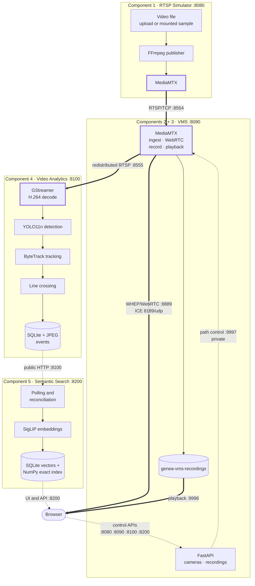

# Genea Video Management System

A live video management system built entirely on open-source streaming
components. RTSP sources are ingested by MediaMTX, viewed live in the browser
over WebRTC/WHEP, recorded continuously and played back from history. Two
optional extensions sit on top: object analytics that emits line-crossing
events, and semantic search over those events by text or image. Everything runs
on a single host as four independent Docker Compose stacks.

---

## Architecture



The Simulator publishes a video file as a real RTSP camera. The VMS pulls that
stream into MediaMTX, redistributes it, serves WebRTC live view to the browser
and records to disk for playback. Analytics pulls the redistributed RTSP stream,
decodes it with GStreamer and writes events; Semantic Search consumes those
events through the Analytics HTTP API and embeds their images for retrieval.
Thick arrows are the media plane, dashed arrows are control and UI traffic — no
video bytes pass through a FastAPI process. Analytics and Semantic Search are
downstream extensions: losing either does not affect live view or recording.

Boundaries, design decisions, tradeoffs and failure behavior are covered in
[docs/architecture.md](docs/architecture.md).

---

## What's included

Five logical components, implemented as four deployable services. Live view and
recording are one service because they share a single MediaMTX instance and
camera registry.

| Service | Purpose | UI |
| --- | --- | --- |
| [RTSP Simulator](services/rtsp-simulator/README.md) | Publishes a video file as a real RTSP camera via FFmpeg + MediaMTX, standing in for hardware | `:8080` |
| [VMS](services/vms/README.md) (components 2 + 3) | Registers RTSP cameras, serves WebRTC live view, records and plays back history | `:8090` |
| [Video Analytics](services/video-analytics/README.md) | Decodes the VMS stream, runs YOLO11n + ByteTrack, emits directional line-crossing events | `:8100` |
| [Semantic Search](services/semantic-search/README.md) | Embeds event images with SigLIP and serves text and image similarity search | `:8200` |

Stack: MediaMTX 1.20.1, FFmpeg, GStreamer 1.24, FastAPI on Python 3.12,
Ultralytics YOLO11n with ByteTrack, SigLIP (base-p16-224), SQLite, Docker
Compose v2. Exact versions and dependency locks live in each service.

---

## Quick start

**Prerequisites:** Git, Docker Desktop or Docker Engine with Compose v2, and
internet access for the first build — base images and the YOLO11n and SigLIP
model assets are downloaded at build time, not at runtime. Allow Docker at least
3 GiB of memory and room for four images (Semantic Search alone is ~2.9 GB). A
WebRTC-capable browser is needed for live view; Chromium is the browser this was
validated against. Ports `8080`, `8090`, `8100`, `8200`, `8554`, `8555`, `8889`
and `9996` (TCP) plus `8189` (UDP) must be free.

```bash
git clone https://github.com/Atharvavp/Genea_VMS.git
cd Genea_VMS

# Analytics is the one service that needs a local env file before it starts.
cp services/video-analytics/.env.example services/video-analytics/.env

./scripts/start-all.sh    # builds and starts all four stacks in dependency order
./scripts/status.sh       # read-only: what is running and what is ready
./scripts/smoke-test.sh   # 38 non-mutating structural and health checks
```

`start-all.sh` preflights Docker and the Analytics `.env`, then brings up
Simulator → VMS → Analytics → Semantic Search, polling each `/health` until
ready. The first run builds four images and takes a while. `status.sh`
distinguishes "container running" from "application ready" from "upstream
available".

```bash
./scripts/stop-all.sh     # reverse order; named volumes are kept
```

`stop-all.sh` runs `docker compose down` without `-v`, so cameras, recordings,
events and the search index survive a stop/start cycle.

The `CURSOR_SIGNING_KEY` in `.env.example` is a well-known local-development
value — replace it before any non-local deployment.

---

## Open the services

| Service | URL | Swagger |
| --- | --- | --- |
| Simulator | http://localhost:8080/ | `/docs` |
| VMS | http://localhost:8090/ | `/docs` |
| Analytics | http://localhost:8100/ | `/docs` |
| Semantic Search | http://localhost:8200/ | `/docs` |

Each service also exposes `/health` and `/openapi.json` on the same port.
Swagger is the API reference, so endpoints are not restated here.

The two RTSP URLs you need during the demo, since services reach each other over
published host ports:

```text
rtsp://host.docker.internal:8554/simulator/<stream_path>   # Simulator → VMS
rtsp://host.docker.internal:8555/vms_<camera-id>           # VMS → Analytics
```

---

## Quick demo

1. `./scripts/start-all.sh`, then `./scripts/status.sh`.
2. At `:8080`, add a camera from a source file and start it; copy its RTSP URL.
3. At `:8090`, register that URL with **Enabled** and **Record continuously**,
   and wait for the tile to reach `ONLINE` / `LIVE`.
4. Once the badge reads `RECORDING`, open **Recordings**, pick today's UTC date
   and play a finalized timespan.
5. At `:8100`, add the VMS camera by its redistributed RTSP URL, then draw a
   line across the path objects travel.
6. Let a person or vehicle cross the line and open the event to see its crop and
   full frame.
7. At `:8200`, search by text or by uploading the event's crop image, and open a
   result for its detail drawer.

The step-by-step walkthrough with expected states, waits and troubleshooting is
in **[docs/demo-guide.md](docs/demo-guide.md)**.

> The bundled `sample-320x240.mp4` is an FFmpeg `testsrc` pattern. It fully
> exercises RTSP ingest, live view, recording and playback, but contains no
> people or vehicles, so it cannot produce analytics events. Steps 5–7 need your
> own H.264 MP4 with a person or vehicle crossing the frame.

---

## Key design decisions

Tradeoffs for each of these are in
[docs/architecture.md](docs/architecture.md#architecture-decisions-and-tradeoffs).

- **MediaMTX owns the media plane.** Ingest, redistribution, WebRTC, recording
  and playback are all delegated to it. The VMS stores desired camera state and
  drives MediaMTX through its Control API; no video byte passes through Python.
- **RTSP for ingest, WHEP/WebRTC for the browser**, giving low-latency
  plugin-free live view at the cost of a narrower codec and browser envelope
  than HLS.
- **GStreamer only where raw frames are needed** — in Analytics. The live path
  is passed through without decoding or re-encoding.
- **Recording is MediaMTX-native**, so it cannot be starved by application work.
- **Analytics runs in its own failure domain**, and Semantic Search consumes it
  over the public HTTP API, keeping event storage owned by Analytics. The
  semantic index is rebuildable from Analytics at any time.
- **Exact NumPy cosine search** rather than FAISS or a vector database — at this
  scale it is simpler, dependency-free and fast enough.
- **Four independent Compose projects** with independent volumes, coordinated by
  thin shell wrappers, so one stack can be reset or rebuilt without touching
  another.

---

## Validation

From the final acceptance run on macOS / Apple Silicon:

- **1,384 automated tests passed, 0 failures**, with 4 documented conditional
  Semantic Search skips.
- Root smoke test: **38 passed, 0 failed**.
- End-to-end RTSP → WebRTC live view verified in Chromium with moving pixels;
  H.264 redistribution probed with `ffprobe`.
- Recording and playback verified: finalized timespan served as `video/mp4` and
  independently probed.
- A real vehicle line crossing produced an event whose crop and frame match the
  recorded bounding box.
- Semantic retrieval over 486 indexed events: a text query for `car` ranked a
  car first, and an event's own crop returned that event at rank 1.
- With Analytics stopped, Semantic Search stayed searchable and resynced on its
  own once Analytics returned.

Full test tiers, the four skips, and the scenarios that were not exercised are
documented in [docs/validation.md](docs/validation.md).

---

## Known limitations

- Single-host local deployment with SQLite and local files. No authentication
  and no TLS — this is a trusted-network reference deployment, not something to
  expose to the internet.
- H.264 is the validated end-to-end path, and Chromium the validated browser.
  The Simulator can publish H.265, but that says nothing about browser or
  analytics compatibility.
- No credentialed physical IP camera and no direct webcam adapter were tested
  end to end; the RTSP chain was exercised through the Simulator.
- Analytics supports one line per camera and six classes (`person`, `bicycle`,
  `car`, `motorcycle`, `bus`, `truck`). Tracking is session-local, with no
  re-identification and no event retention policy.
- Semantic Search retrieves Analytics events only — not arbitrary video frames —
  and does no transcription or identity search.
- Playback serves no byte ranges, recording history is browsable only while a
  camera is enabled, and deleting a camera leaves its recordings behind.
- No load, soak or chaos testing, and no multi-node failover or backup/restore
  procedure.

---

## Repository structure

```text
services/rtsp-simulator/    # Component 1 — RTSP source simulation
services/vms/               # Components 2 and 3 — live view, recording, playback
services/video-analytics/   # Component 4 — detection, tracking, events
services/semantic-search/   # Component 5 — semantic event retrieval
scripts/                    # root lifecycle wrappers (start / status / smoke / stop)
docs/                       # architecture, demo guide, validation
```

Each service directory holds its own Compose project, Dockerfile, dependency
lock, tests and README, and runs standalone — the root scripts are convenience
wrappers, not a requirement.

---

## Documentation

- [docs/architecture.md](docs/architecture.md) — architecture, boundaries and engineering decisions
- [docs/demo-guide.md](docs/demo-guide.md) — full end-to-end walkthrough
- [docs/validation.md](docs/validation.md) — validation evidence and limitations
- Service READMEs — component setup and API details:
  [Simulator](services/rtsp-simulator/README.md) ·
  [VMS](services/vms/README.md) ·
  [Analytics](services/video-analytics/README.md) ·
  [Semantic Search](services/semantic-search/README.md)
- Swagger at `/docs` on each service — REST API reference
