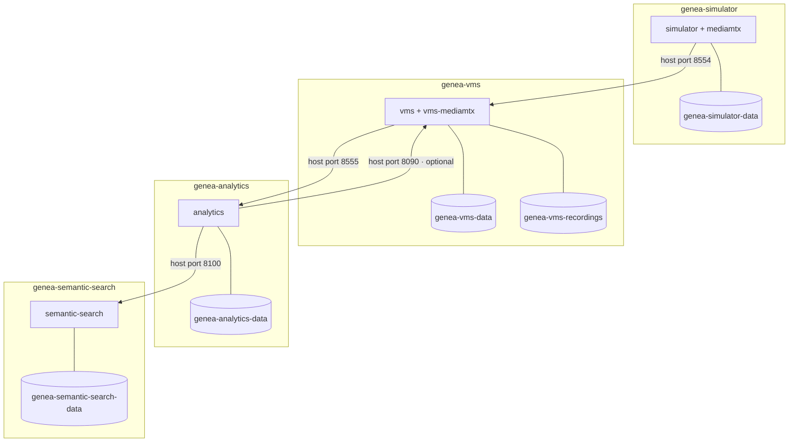

# Architecture

The design document requested by the assignment: **why** the Genea VMS is shaped
this way, what each boundary owns, and what the choices cost.

For what to run, see the [README](../README.md). For a step-by-step walkthrough,
see the [demo guide](demo-guide.md). For measured evidence, see
[validation](validation.md).

---

## Goals and constraints

**Goals.** Capture live video from an RTSP source with open-source components
only; deliver it to a browser with low latency; record it and play it back from
history; keep the system understandable and reproducible; treat AI inference and
semantic search as genuinely optional extensions that strengthen the submission
without becoming the submission.

**Constraints that shaped every decision:**

- **One host, one week.** A take-home exercise, not a fleet deployment. Anything
  that could not be built *and validated* here was documented as a direction
  rather than half-built.
- **No proprietary streaming engine.** The assignment forbids it, and it removes
  the easiest shortcut for WebRTC delivery.
- **The core streaming path must not depend on the optional extensions.** A
  reviewer who never starts Analytics must still get the complete live,
  recording and playback story.
- **Reproducibility over cleverness.** Pinned images, pinned models baked at
  build time, dependency locks, and no runtime model downloads.

**Explicit non-goals** are listed in [Known limitations and non-goals](#known-limitations-and-non-goals).

---

## System context

The reviewer-facing story is streaming-first:

```text
RTSP source ─▶ VMS MediaMTX ─▶ WebRTC/WHEP ─▶ browser live view
                    └────────▶ recording ──▶ historical playback
                    └────────▶ redistributed RTSP ─▶ Analytics ─▶ events ─▶ Semantic Search
```

Five logical components are deployed as four services. Components 2 and 3 are
one service because live view and recording are two behaviours of **one**
MediaMTX instance driven by **one** camera registry. Splitting them would mean
two processes writing paths into the same media server — two sources of truth
for one piece of state, for no operational gain at this scale.

| Logical component | Service directory | Compose project |
| --- | --- | --- |
| C1 RTSP Simulator | `services/rtsp-simulator/` | `genea-simulator` |
| C2 Live View + C3 Recording & Playback | `services/vms/` | `genea-vms` |
| C4 Video Analytics | `services/video-analytics/` | `genea-analytics` |
| C5 Semantic Search | `services/semantic-search/` | `genea-semantic-search` |

There is no root Compose file, no shared application database, no shared Docker
network and no shared filesystem mount between services.

---

## Responsibility boundaries

| Service | Owns | Explicitly does **not** own |
| --- | --- | --- |
| **C1 Simulator** | Camera records and their source files; one FFmpeg publisher per running camera; its own MediaMTX for RTSP output | Anything downstream. It never calls the VMS, and does not know it exists |
| **C2/C3 VMS** | The camera registry and desired state (enabled, recording); MediaMTX path lifecycle; recording configuration; resolution of camera + UTC date to finalized timespans and playback URLs | Media bytes — no frame passes through the VMS process. It does not read recording files, and does not know about Analytics |
| **C4 Analytics** | Its own camera bindings, line geometry, worker lifecycle, detections, tracks, crossing events, and event artifacts (crop and frame JPEGs) | The VMS. It cannot create, enable, disable or control a VMS camera. It has no MediaMTX Control API access, and no write access to recordings |
| **C5 Semantic Search** | Its own copy of event metadata, its embeddings, its index snapshot, and its search API | Event truth. Component 4 is authoritative; C5 holds derived, rebuildable state, and reaches C4 **only** over public HTTP |

Two boundaries are worth stating twice, because they are the ones that are
easiest to draw wrongly:

- **Component 5 never reads Component 4's SQLite database or its filesystem.**
  Everything — event discovery, metadata, crop and frame images — arrives over
  `GET http://host.docker.internal:8100/api/...`. This was verified by static
  scan: the service's executable code contains no `docker.sock`, no
  `/recordings`, no `:9997`, and no `rtsp://`.
- **Analytics does not own or drive the VMS.** It consumes a redistributed RTSP
  stream and, optionally, reads the public `GET /api/recordings` endpoint. That
  is the entire relationship.

---

## Media flow

Video moves only between media components. It never enters a Python request
handler.

1. **Source → C1.** A file is uploaded through the browser or selected from the
   read-only `sample-media/` mount. One FFmpeg process per running camera
   publishes it to the Simulator's MediaMTX. The camera's `RUNNING` state means
   *that publisher process is alive* — not that anything downstream is receiving
   frames.
2. **C1 → VMS.** The host route is `rtsp://localhost:8554/simulator/<stream_path>`.
   From inside another container it is
   `rtsp://host.docker.internal:8554/simulator/<stream_path>` — the host
   address, because these are separate Compose networks. RTSP is pinned to TCP
   in both MediaMTX configurations: UDP RTP/RTCP does not survive ordinary
   Docker port mapping.
3. **VMS MediaMTX branches three ways.** The same ingested stream is delivered
   to the browser over WHEP/WebRTC on `:8889` (with ICE media on `8189/udp`),
   written to the recording volume when the camera has recording enabled, and
   redistributed as RTSP on `:8555` at path `vms_<camera-id>`.
4. **VMS → C4.** Analytics pulls `rtsp://host.docker.internal:8555/vms_<camera-id>`.
   It consumes the redistribution, never the original source — so the VMS stays
   the single ingest point for a camera.

The host-versus-container URL distinction is the single most common setup
mistake: a URL that works in `ffprobe` on the host (`localhost`) will not work
when pasted into a container-side configuration field, which needs
`host.docker.internal`.

---

## Control and API flow

Every service exposes a FastAPI application with `/` (dashboard), `/health`,
`/docs` (Swagger) and `/openapi.json`. All four dashboards are static
HTML/CSS/JS talking to their own service's API — there is no frontend build step
and no cross-service browser call except the browser fetching media directly
from MediaMTX.

- **VMS → MediaMTX Control API on `:9997`.** The VMS creates, updates and
  removes one MediaMTX path per enabled camera, sending the complete path
  configuration (including its recording block) on every update. This is the
  only privileged control channel in the system, and **port 9997 is deliberately
  not published to the host.** The MediaMTX config widens API permissions to the
  Compose network precisely *because* the port is unreachable from outside it;
  publishing it would require real credentials.
- **C4 → VMS `GET /api/recordings`.** Read-only, optional, and used solely to
  answer "is there a recording covering this event?". If the VMS is unreachable,
  events are still created — only the recording lookup degrades.
- **C5 → C4 public API.** Event discovery, metadata reconciliation and image
  fetching, all over HTTP.
- **Browser → each service's own API**, plus direct media fetches from MediaMTX
  for live (`:8889`) and playback (`:9996`).

---

## Recording and playback

Recording is delegated to MediaMTX rather than implemented in Python.

- **Desired state lives in the VMS.** `recording_enabled` is a per-camera
  preference in SQLite. It defaults to `false`: registering a camera never
  starts writing to disk. Recording runs only while the camera is also enabled,
  but the preference persists, so a disabled camera resumes recording when it is
  re-enabled.
- **MediaMTX is the only writer and the only reader** of the
  `genea-vms-recordings` volume. The VMS container deliberately does not mount
  it. Segments default to 5 minutes with a 24-hour retention setting.
- **MediaMTX is authoritative for what exists.** There is no recording index
  table and no filesystem scan — the playback server already answers "which
  finalized recordings exist for this path on this day?", and duplicating that in
  SQLite would create a second source of truth that could disagree with the
  files on disk.
- **What the VMS adds** is the part MediaMTX cannot do: resolving a *camera id*
  to the MediaMTX path that camera owns (so a client never supplies a path and
  cannot request another camera's history), turning a UTC calendar date into a
  query window, and building public playback URLs from VMS settings rather than
  echoing MediaMTX's Compose-internal address.
- **The browser fetches recorded media directly from `:9996`.** No recorded byte
  passes through the VMS process.

Two honest caveats. The UI recording badge (`REC OFF` / `WAITING` /
`RECORDING` / `REC ERROR`) is inferred from configuration and source
availability — it is **not** byte-level proof that a file is growing. And
playback responses carry `Accept-Ranges: none`, so there is no seeking by byte
range within a segment.

Playback failures are reported as *historical playback* failures and are never
folded into a camera's recording state: a camera can be recording perfectly well
while the playback server is unreachable.

---

## Analytics pipeline

Component 4 is a standalone FastAPI service with its own SQLite metadata store
and its own JPEG event artifacts.

**Per enabled camera, one worker thread owns the whole media path:**

```text
rtspsrc (TCP) ─▶ rtph264depay ─▶ h264parse ─▶ avdec_h264
              ─▶ videoconvert ─▶ RGB ─▶ appsink (max-buffers=1, drop=true)
```

- **Latest-frame semantics.** The appsink keeps one buffer and drops the rest,
  and `drop-on-latency` is set on the source. Under load the pipeline discards
  stale frames rather than accumulating latency — analytics on old frames is
  worse than analytics on fewer frames.
- **Sampling** targets a configurable **1–10 inference FPS** (default 5), so
  inference cost is decoupled from source frame rate.
- **One shared detector for the process.** YOLO11n is loaded once for the whole
  service. Workers compete for it with a *non-queuing* admission lock: a worker
  that loses admission drops that inference opportunity instead of queueing
  behind another camera. This bounds latency per camera rather than letting one
  slow camera build a backlog for everyone — at the cost of fairness being
  host-dependent under oversubscription.
- **Tracking is per worker session.** A `ByteTrackTracker` is instantiated
  directly, one instance per worker session, so two cameras can never share
  tracker state. Ultralytics' bundled `YOLO.track` is deliberately not used: it
  attaches tracker state to a shared mutable predictor. **ByteTrack associates
  detections across frames within one session; it is not re-identification** and
  carries no identity across cameras, sessions or restarts.
- **Supported classes** are exactly `person`, `bicycle`, `car`, `motorcycle`,
  `bus`, `truck`, grouped into the `person` and `vehicle` categories. Other COCO
  classes are not remapped in.

**Line crossing.** Each camera has at most **one** normalized line (endpoints in
0–1 coordinates, so geometry is resolution-independent). Configuration accepts
`A_TO_B`, `B_TO_A` or `BOTH`; the emitted event records the *actual* direction
the object crossed, not the configured filter. When a tracked object's centre
crosses the segment in an allowed direction, the service writes a durable event:
metadata (class, category, direction, confidence, track id, worker session,
`crossed_at`, normalized bbox, frame size), a cropped JPEG of the object, and
the full frame.

**Failure behaviour.** A lost source moves the worker to `RECONNECTING` and it
retries with exponential backoff and jitter — `RECONNECTING` means *retrying*,
not *working*. Fatal model, configuration or storage errors surface as `ERROR`
rather than retrying forever. Analytics failing does not affect live view,
recording, or Component 5's search over already-indexed data.

---

## Event and semantic-search lifecycle

Component 5 turns Component 4's events into searchable vectors.

1. **Discovery.** C5 polls C4's public event API on a fixed cadence (10 s by
   default) with a **300-second overlap window**, plus a periodic full
   reconciliation. The overlap makes discovery safe against clock skew and
   events that land slightly out of order.
2. **Embedding.** For each event, both the **crop** and the **full frame** are
   embedded with a pinned SigLIP checkpoint (`base-p16-224`, pinned by revision
   and SHA-256, baked into the image). The model never downloads at runtime —
   this was verified with the container on `--network none`. Vectors are 768-D
   normalized `float32`, persisted with their metadata in C5's own SQLite.
3. **Index.** Vectors are assembled into an **immutable in-memory NumPy
   snapshot**, built off-lock and swapped in atomically. A search takes one
   reference and reads only that: no database I/O, no write lock, and it cannot
   observe a half-built index. Publishing a new snapshot never mutates the old
   one, so an in-flight search keeps a consistent view while indexing continues.
   An event becomes searchable once its **crop** is indexed; the frame vector is
   optional.
4. **Search.** Because vectors are normalized, cosine similarity is a matrix
   multiply against the snapshot — **every candidate is scored, exactly.** Crop
   and frame are scored separately against the same query vector and collapse to
   one event score with `max(crop, frame)`. `min_score` and top-K are applied
   *after* that aggregation. Ties break deterministically by score DESC,
   `crossed_at` DESC, `event_id` ASC.
5. **Query modes.** Free text, or an uploaded JPEG/PNG, with filters for camera,
   category, class, direction, UTC time range, top-K and minimum score.

**What this is not.** It is not a vector database, and it is not RAG: there is
no external index service, no approximate search, no generative model and no
retrieval-augmented text generation anywhere in the system. It searches
**Component 4 events**, not arbitrary frames from recordings. Scores are cosine
similarities, not probabilities or confidences.

---

## Persistence and isolation

| Volume | Owner | Contents |
| --- | --- | --- |
| `genea-simulator-data` | C1 | Camera database and uploaded source videos |
| `genea-vms-data` | VMS | Camera registry and desired state |
| `genea-vms-recordings` | VMS MediaMTX | Recorded segments (MediaMTX is sole reader and writer) |
| `genea-analytics-data` | C4 | Event database and event JPEG artifacts |
| `genea-semantic-search-data` | C5 | Event copies, embeddings and index state |

Every service mounts **only its own** volume. No SQLite file, no image directory
and no recording path is shared across services, and no service can invalidate
another's data.



**How to read the failure domains.** Each box is one Compose project with its
own volumes; every arrow crosses a **published host port**, never a shared
network or mount. Stopping `genea-analytics` leaves live view, recording and
playback fully working, and leaves Semantic Search searchable over what it has
already indexed. Stopping `genea-semantic-search` affects nothing upstream.
Stopping `genea-simulator` only removes the source, and the VMS reports it
honestly as `OFFLINE`. The one arrow that points "backwards" — Analytics reading
the VMS recording API — is read-only and optional: losing it degrades recording
lookup for an event and nothing else.

Each stack is a separate Compose project with an explicit `name:`. This is not
cosmetic: before the services were unified, two of them resolved to the same
implicit project name (from their directory basenames), which meant a
`docker compose down --remove-orphans` in one could remove the other's
containers. With explicit names, `down --remove-orphans` and even `down -v` in
one stack were verified to touch nothing but that stack.

Cross-stack integration deliberately uses **published host ports** with
`host.docker.internal:host-gateway`, rather than a shared Docker network. The
benefit is that every hop is a real, observable, externally reproducible
network call — a reviewer can `ffprobe` or `curl` any integration point from the
host. The cost is a platform dependency: this was verified on Docker Desktop for
macOS, and the `host-gateway` mapping was **not** exercised on native Linux. It
is also not how production service discovery should work.

---

## Failure and recovery behavior

| Event | Effect | Recovery |
| --- | --- | --- |
| Simulator camera stopped | That RTSP route disappears; the VMS reports the source `OFFLINE` | Restarting the camera restores the route; the VMS returns to `ONLINE` |
| VMS source unreachable | Source health goes `OFFLINE`, independently of the browser player state; desired camera and recording state persist | Automatic once the source returns |
| Analytics source lost | Worker enters `RECONNECTING` and retries with exponential backoff and jitter | Automatic; a new worker session id is issued on reconnect |
| Analytics service stopped | Live view and recording are unaffected. C5 keeps serving search over already-indexed data | Restart; C5 resumes polling on its own |
| Component 4 unreachable from C5 | C5 reports `status: degraded` with `search: ok`, `upstream: unavailable`, `indexing: paused`. Local search and event detail keep working. Upstream-backed images return an explicit error rather than a wrong answer. No vector is invalidated | Automatic, without restarting or reloading C5 |
| Semantic Search stopped | Nothing upstream is affected | Restart; the index is on its own volume, and is in any case rebuildable from C4 |
| Container loss | Named volumes survive; state is restored on the next start | `./scripts/start-all.sh` |

The general shape: **failures propagate downstream, never upstream.** Each
service degrades in a way it can describe accurately, rather than failing
silently or reporting a healthy state it cannot back up.

---

## Architecture decisions and tradeoffs

| Decision | Context | Choice | Benefit | Tradeoff |
| --- | --- | --- | --- | --- |
| **MediaMTX for the media plane** | RTSP ingest, WebRTC delivery, recording and playback all needed, with no proprietary engine allowed | Delegate all four to one purpose-built open-source server; FastAPI holds only desired state | No media code to write, debug or scale; recording cannot be starved by application work; the media plane keeps running while the API restarts | A dependency whose behaviour and configuration surface must be understood; some semantics (finalization timing, no byte ranges) are its, not ours |
| **WHEP/WebRTC for browser live** | Low-latency live view without a plugin | MediaMTX's WHEP endpoint plus a thin JS reader | Sub-second latency; no transcoding; no media server written in Python | Narrower codec and browser envelope than HLS; needs a UDP ICE port published; validated on Chromium only |
| **No GStreamer in the VMS live path** | GStreamer is already a dependency of Analytics | Keep it strictly at the Analytics boundary, where raw frames are genuinely required | The live path is never decoded or re-encoded; one fewer failure mode and CPU consumer in the critical path | Analytics must decode independently, duplicating decode work when both live view and analytics run |
| **Analytics as a separate service** | AI is optional; live streaming is not | Its own image, process, volume and Compose project | An inference failure, model bug or memory spike cannot reach live view or recording — verified by stopping it | Cross-service integration cost, and a second decode of the same stream |
| **MediaMTX-native recording** | Alternative was Python reading frames and writing files | Configure recording per path through the Control API | Recording continues independent of application load; no frame-level code path to get wrong | Segment finalization timing is MediaMTX's; the UI can only *infer* that recording is healthy |
| **Per-camera workers, one shared detector** | CPU-only inference for several cameras | One worker thread per camera; one process-wide model behind a non-queuing admission lock | Bounded per-camera latency; no cross-camera queueing; tracker state can never be shared | Fairness under oversubscription is host-dependent; a camera that loses admission drops that inference opportunity |
| **Event-oriented semantic search** | Searching all recorded video is a much larger problem | Search Component 4's events, with C4 authoritative and C5 derived | The index is small, rebuildable and always explainable; C4 needs no knowledge of C5 | Nothing outside an event is searchable — no arbitrary-frame or full-recording search |
| **Pinned SigLIP + exact NumPy search** | Thousands of events, single host | Bake the model at build time; exact cosine search over an immutable snapshot | No ANN tuning, no recall cliff, no extra service to run or back up; results are exactly reproducible | Linear in corpus size — the right answer at this scale, and the wrong one at millions of vectors |
| **Independent Compose stacks + thin root wrappers** | Four services that must not entangle | Four projects with explicit names and their own volumes; four shell scripts for ordering and readiness | One stack can be reset, rebuilt or broken without touching another; every service still runs standalone | Not real orchestration: no dependency graph, no restart policy management, no rollout control |
| **Host-published cross-stack integration** | Alternative was one shared Docker network | Every hop over a published host port with `host.docker.internal` | Every integration point is externally observable and reproducible from the host | Platform-dependent (`host-gateway` unverified on native Linux); ports are exposed on the host; not production service discovery |

---

## Scalability

The two subsections below are deliberately separated. The first describes what
exists and was exercised. The second describes directions that are **not
implemented** anywhere in this repository.

### Current implementation

- **Deployment:** one host, four Compose projects, CPU only.
- **Ingest:** one FFmpeg publisher per running simulated camera. Real cameras
  need no publisher — the VMS pulls them directly.
- **Media plane:** MediaMTX handles fan-out. One ingested stream serves the
  browser, the recorder and Analytics without additional decode in the VMS.
- **Analytics:** one worker thread per enabled camera; latest-frame-drop
  sampling; configurable 1–10 inference FPS; one shared CPU detector with
  non-queuing admission; per-camera tracker state. Measured warm inference at
  `imgsz=640` was ~53 ms — **an observation on one idle host, not a guarantee.**
- **Persistence:** single-node SQLite plus JPEG files per service. Analytics has
  no event retention policy, so its store grows monotonically.
- **Search:** asynchronous embedding; a locally persisted vector store; exact
  in-memory NumPy search designed for a thousands-scale corpus.
- **Tested scale:** a four-camera Analytics tier and a Semantic Search scale
  tier at 1k/5k/10k events. These prove the design holds at those sizes. **They
  do not establish large-fleet capacity.**

The honest bottlenecks, in the order they would bite: CPU inference throughput
first, then single-writer SQLite, then exact search as the corpus grows past
tens of thousands of events, then single-host network and disk.

### Future scale-out direction — NOT IMPLEMENTED

None of the following exists in this repository:

- **Partitioning:** shard cameras across multiple VMS and Analytics nodes, with
  a routing layer mapping camera to node.
- **Inference:** GPU execution, bounded batching across cameras, and horizontally
  replicated inference workers behind a queue.
- **Storage:** an external metadata database (PostgreSQL) instead of SQLite, and
  object storage for event images and recordings, with real retention and
  lifecycle policies.
- **Decoupling:** an event bus between detection and indexing, so a slow indexer
  cannot back-pressure detection.
- **Search:** independent index-builder and query replicas; approximate (ANN) or
  a distributed vector service **only when measurements show exact search has
  stopped being adequate** — not before.
- **Operations:** metrics, structured logs, traces and alerting; load, soak and
  chaos testing.
- **Platform:** container orchestration, service discovery, a reverse proxy,
  TLS, authentication and authorization, secret management, and network policy.

---

## Security and deployment caveats

This is a **local, trusted-network reference deployment.** Do not expose it to
the internet as it stands.

- **No authentication and no TLS on any service.** Every dashboard and API is
  open to anyone who can reach the port.
- **The WebRTC endpoint (`:8889`) and the playback server (`:9996`) are
  unauthenticated.** Anyone who can reach them and knows a path name can watch a
  camera live or fetch its recordings.
- **The MediaMTX Control API (`:9997`) is unauthenticated but unpublished.** Its
  permissions are widened to the Compose network *only* because the port is not
  reachable from the host. Publishing it without adding real credentials would
  hand over full control of the media server.
- **Camera credentials.** RTSP URLs may contain credentials; the VMS stores them
  and does not echo them back to the UI, but they are not encrypted at rest.
- **The example `CURSOR_SIGNING_KEY`** shipped in
  `services/video-analytics/.env.example` is a well-known development value.
  Event page cursors can be forged by anyone who has read that file, so it must
  be replaced outside local use.
- Containers run with `no-new-privileges` and dropped capabilities where the
  workload allows, but that is hardening, not a security boundary.

---

## Known limitations and non-goals

**Limitations**

- Single-host, single-node, local SQLite and local files throughout.
- H.264 is the validated end-to-end codec. H.265 publishing exists in the
  Simulator but implies nothing about browser or analytics compatibility.
- Validated on macOS / Apple Silicon with Docker Desktop. **amd64 was not built
  or tested, and native Linux `host-gateway` was not exercised.**
- Browser end-to-end coverage is Chromium only.
- No credentialed physical IP camera and no direct webcam adapter were tested
  end to end.
- One line per Analytics camera; six object classes; session-local tracking with
  no re-identification; no event retention policy.
- Recording history can only be browsed while a camera is enabled; playback
  serves no byte ranges; deleting a camera leaves its recordings on disk.
- Semantic Search covers Component 4 events only, and its accepted results come
  from a single fixed traffic corpus — not a general retrieval accuracy claim.
- No load, soak or chaos testing; no multi-node failover; no backup and restore
  procedure.

**Non-goals** — deliberately out of scope, not missing work: cloud deployment
and Amazon Kinesis Video Streams integration; authentication, RBAC and
multi-tenancy; an observability stack; Kubernetes or any orchestration beyond
Compose; a reverse proxy; arbitrary-frame or full-recording semantic search;
re-identification or biometric identity search; RAG or any generative
capability; production certification of any kind.

---

## Evidence and further reading

- [validation.md](validation.md) — the measured evidence behind every claim here
- [demo-guide.md](demo-guide.md) — see the architecture running
- [README](../README.md) — quick start, ports and reviewer orientation
- Service internals:
  [Simulator](../services/rtsp-simulator/README.md) ·
  [VMS](../services/vms/README.md) ·
  [Analytics](../services/video-analytics/README.md) ·
  [Semantic Search](../services/semantic-search/README.md)
- [Unified submission handoff](engineering-handoffs/HANDOFF_unified_submission.md) — the acceptance record, including §9 "What is NOT proven"
